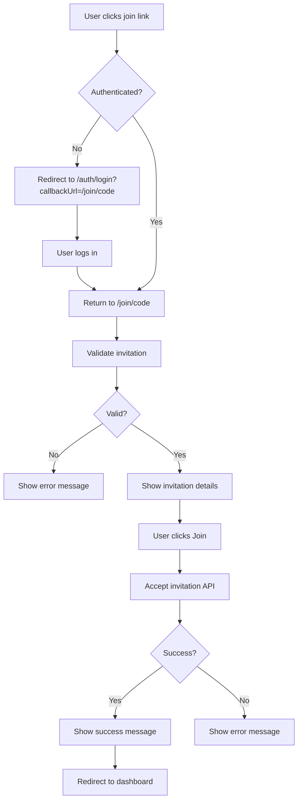

# 🔗 Join Page Implementation

## Overview

A dedicated join page that allows users to join a company using an invitation code directly from a URL link.

## Features

✅ **Direct URL Access** - Users can join via `/join/[code]` links  
✅ **Automatic Validation** - Invitation is validated automatically on page load  
✅ **Authentication Check** - Redirects to login if user is not authenticated  
✅ **Detailed Information** - Shows company details before joining  
✅ **One-Click Join** - Simple button to accept invitation  
✅ **Error Handling** - Clear error messages for invalid/expired invitations  
✅ **Success Feedback** - Confirmation message and auto-redirect to dashboard

---

## How It Works

### **For Users (Existing Account):**

1. **Receive Invitation Link**
   - Admin shares link: `https://your-app.com/join/abc123def456...`

2. **Click Link**
   - Opens join page
   - If not logged in, shows "Sign In" and "Register" buttons
   - Click "Sign In" and login
   - Returns to join page automatically

3. **Review Invitation**
   - See company name
   - See team size
   - See who invited them
   - See expiration date

4. **Join Company**
   - Click "Join Company" button
   - Automatically joins as AGENT role
   - Redirects to dashboard

### **For New Users (No Account):**

1. **Receive Invitation Link**
   - Admin shares link: `https://your-app.com/join/abc123def456...`

2. **Click Link**
   - Opens join page showing sign in requirement
   - See "Don't have an account? Register here" link

3. **Register Account**
   - Click "Register here"
   - Fill in registration form (name, email, password)
   - Submit registration
   - Redirects to login page (with callback URL preserved)

4. **Login**
   - Enter credentials
   - Automatically redirects back to join page

5. **Join Company**
   - Review invitation details
   - Click "Join Company"
   - Joins as AGENT role (no need to create own company!)
   - Redirects to dashboard

### **For Admins:**

1. **Create Invitation**
   - Go to Company settings (or use API)
   - Create invitation code
   - Get link: `/join/[code]`

2. **Share Link**
   - Send via email
   - Share in Slack/Teams
   - Post in internal docs
   - Share anywhere

---

## URL Structure

```
/join/[code]
```

**Example:**
```
https://your-app.com/join/abc123def456ghi789
```

Where `abc123def456ghi789` is the invitation code.

---

## Page Flow



---

## Files Created/Modified

### **Created:**

1. ✨ **`src/app/join/[code]/page.tsx`**
   - Main join page component
   - Handles authentication redirect
   - Validates invitation
   - Displays invitation details
   - Accepts invitation

### **Modified:**

2. ✏️ **`src/app/auth/login/page.tsx`**
   - Added support for `callbackUrl` query parameter
   - Redirects to callback URL after login
   - Maintains join flow after authentication

3. ✏️ **`src/app/auth/register/page.tsx`**
   - Added support for `callbackUrl` query parameter
   - Redirects to login with callback URL after registration
   - "Sign in here" link preserves callback URL
   - Enables seamless registration-to-join flow

4. ✏️ **`middleware.ts`**
   - Added `/join/*` routes to allowed paths
   - Users can access join pages without being redirected
   - Authentication is handled by the page itself

---

## API Endpoints Used

### **1. Validate Invitation**
```
POST /api/companies/invitations/validate
```

**Request:**
```json
{
  "code": "abc123def456..."
}
```

**Response:**
```json
{
  "valid": true,
  "invitation": {
    "companyName": "Acme Inc",
    "memberCount": 5,
    "invitedBy": "John Doe",
    "expiresAt": "2025-02-27T00:00:00.000Z",
    "maxUses": 5,
    "usedCount": 2,
    "remainingUses": 3
  }
}
```

### **2. Accept Invitation**
```
POST /api/companies/invitations/accept
```

**Request:**
```json
{
  "code": "abc123def456..."
}
```

**Response:**
```json
{
  "success": true,
  "company": {
    "id": "comp_123",
    "name": "Acme Inc"
  }
}
```

---

## UI Components

### **Loading State**
Shown while:
- Checking authentication
- Validating invitation

### **Error State**
Shown when:
- Invitation is invalid
- Invitation is expired
- Invitation is paused
- Invitation is fully used
- User already has a company
- Email mismatch (for email-specific invitations)

### **Success State**
Shown after:
- Successfully joining company
- Auto-redirects to dashboard after 2 seconds

### **Invitation Details**
Displays:
- Company name
- Team size (number of members)
- Invited by (name of admin who created invitation)
- Expiration date
- Usage count (for multi-use invitations)
- Current user's email

---

## Error Messages

| Scenario | Message |
|----------|---------|
| Invalid code | "Invalid invitation code" |
| Expired | "Invitation has expired" |
| Paused | "This invitation has been paused" |
| Fully used | "This invitation has reached its maximum number of uses" |
| Already member | "You already belong to a company" |
| Email mismatch | "This invitation is for a different email address" |

---

## Example Usage

### **Step 1: Admin Creates Invitation**

Using API:
```bash
curl -X POST https://your-app.com/api/companies/invitations/create \
  -H "Content-Type: application/json" \
  -H "Cookie: session=..." \
  -d '{
    "email": "newuser@example.com",
    "expiresInDays": 7,
    "maxUses": 1
  }'
```

Response:
```json
{
  "success": true,
  "invitation": {
    "code": "abc123def456ghi789",
    "link": "https://your-app.com/join/abc123def456ghi789"
  }
}
```

### **Step 2: Admin Shares Link**

Send via email:
```
Hi there!

You've been invited to join our team on the Dashboard.

Click here to join: https://your-app.com/join/abc123def456ghi789

This invitation expires in 7 days.

Welcome aboard!
```

### **Step 3: User Joins**

1. User clicks link
2. If not logged in, logs in or registers
3. Returns to join page
4. Sees company details
5. Clicks "Join Company"
6. Joins as AGENT role
7. Redirects to dashboard

---

## Security Features

### **1. Authentication Required**
- Must be logged in to join
- Redirects to login if not authenticated
- Returns to join page after login

### **2. Validation Checks**
- Code must exist
- Must be active (not paused)
- Must not be expired
- Must have remaining uses
- Email must match (if email-specific)
- User must not already have a company

### **3. Session Update**
- Updates user session after joining
- Assigns user to company
- Sets role to AGENT

### **4. Rate Limiting**
- All API endpoints are rate-limited
- Prevents abuse and spam

---

## Testing Guide

### **Test 1: Valid Invitation**

1. Create invitation code
2. Open `/join/[code]` in browser
3. Should show invitation details
4. Click "Join Company"
5. Should successfully join and redirect

### **Test 2: Unauthenticated User**

1. Logout from application
2. Open `/join/[code]` in browser
3. Should redirect to login page
4. URL should be: `/auth/login?callbackUrl=/join/[code]`
5. Login
6. Should return to join page
7. Should show invitation details

### **Test 3: Invalid Code**

1. Open `/join/invalid-code`
2. Should show error: "Invalid invitation code"
3. Should show "Try Again" and "Go to Dashboard" buttons

### **Test 4: Expired Invitation**

1. Create invitation that expires in 1 day
2. Manually update DB to set `expiresAt` to yesterday
3. Open `/join/[code]`
4. Should show error: "Invitation has expired"

### **Test 5: Paused Invitation**

1. Create invitation
2. Pause it via toggle API
3. Open `/join/[code]`
4. Should show error: "This invitation has been paused"

### **Test 6: Fully Used Invitation**

1. Create invitation with `maxUses: 1`
2. Accept it with User 1
3. Try to use same code with User 2
4. Should show error: "This invitation has reached its maximum number of uses"

### **Test 7: Already Has Company**

1. User is already member of Company A
2. Receive invitation to Company B
3. Open `/join/[code]`
4. Should show error: "You already belong to a company"

### **Test 8: Email Mismatch**

1. Create invitation for `john@example.com`
2. Login as `jane@example.com`
3. Open `/join/[code]`
4. Should show error: "This invitation is for a different email address"

### **Test 9: Multi-Use Invitation**

1. Create invitation with `maxUses: 5`
2. Accept with User 1
3. Accept with User 2
4. Both should successfully join
5. Invitation should show: "2/5 uses"

---

## Integration Examples

### **Email Template**

```html
<!DOCTYPE html>
<html>
<head>
  <title>Company Invitation</title>
</head>
<body style="font-family: Arial, sans-serif; padding: 20px;">
  <div style="max-width: 600px; margin: 0 auto; background: #f9fafb; padding: 30px; border-radius: 8px;">
    <h1 style="color: #111827; margin-bottom: 16px;">You're Invited!</h1>
    
    <p style="color: #4b5563; font-size: 16px; line-height: 1.5;">
      You've been invited to join <strong>{{companyName}}</strong> on our platform.
    </p>
    
    <div style="margin: 30px 0;">
      <a href="{{joinUrl}}" 
         style="display: inline-block; background: #111827; color: white; padding: 12px 24px; text-decoration: none; border-radius: 6px; font-weight: 600;">
        Join Company
      </a>
    </div>
    
    <p style="color: #6b7280; font-size: 14px;">
      This invitation expires on <strong>{{expiresAt}}</strong>
    </p>
    
    <p style="color: #9ca3af; font-size: 12px; margin-top: 30px; padding-top: 20px; border-top: 1px solid #e5e7eb;">
      If you didn't expect this invitation, you can safely ignore this email.
    </p>
  </div>
</body>
</html>
```

### **Slack Integration**

```javascript
// Send invitation via Slack
async function sendSlackInvitation(code, channelId) {
  const joinUrl = `${process.env.APP_URL}/join/${code}`;
  
  await slackClient.chat.postMessage({
    channel: channelId,
    blocks: [
      {
        type: "section",
        text: {
          type: "mrkdwn",
          text: "*You've been invited to join our team!*\n\nClick the button below to accept the invitation and get started.",
        },
      },
      {
        type: "actions",
        elements: [
          {
            type: "button",
            text: {
              type: "plain_text",
              text: "Join Company",
            },
            url: joinUrl,
            style: "primary",
          },
        ],
      },
    ],
  });
}
```

---

## Future Enhancements

### **Phase 1:**
- [ ] QR code generation for invitation links
- [ ] Copy invitation link button in UI
- [ ] Invitation preview before sharing

### **Phase 2:**
- [ ] Email invitations (auto-send via email)
- [ ] Customizable welcome message
- [ ] Role selection on invitation (AGENT/ADMIN)

### **Phase 3:**
- [ ] Department/team assignment on join
- [ ] Onboarding flow after joining
- [ ] Welcome tour for new members

---

## Troubleshooting

### **Issue: Redirect loop after login**
**Solution:** Clear browser cookies and try again. Check that `callbackUrl` is properly encoded.

### **Issue: "Unauthorized" error**
**Solution:** Make sure user is logged in. Check session status in browser dev tools.

### **Issue: "Invalid invitation code"**
**Solution:** Verify code is correct. Check database for invitation status.

### **Issue: Page shows loading forever**
**Solution:** Check browser console for errors. Verify API endpoints are accessible.

---

## Key Features

### **✅ No Company Creation Required**

New users can join via invitation without creating their own company:
- Register → Login → Join → Done!
- No "Create Company" modal shown to invited users
- Directly join as AGENT role
- Skip the company setup flow entirely

### **✅ Seamless Registration Flow**

The entire flow preserves the callback URL:
1. Click invitation link → `/join/abc123`
2. Click "Register here" → `/auth/register?callbackUrl=/join/abc123`
3. Complete registration → `/auth/login?callbackUrl=/join/abc123`
4. Login → Returns to `/join/abc123`
5. Accept invitation → Dashboard

### **✅ Middleware Configuration**

- `/join/*` routes are accessible without authentication check
- No redirect to company setup for users without companies
- Allows invitation acceptance before company assignment

---

## Summary

✅ **Join page created** at `/join/[code]`  
✅ **Login page updated** to support callback URLs  
✅ **Register page updated** to support callback URLs  
✅ **Middleware updated** to allow join routes  
✅ **New user flow** - register and join without creating company  
✅ **Full authentication flow** implemented  
✅ **Error handling** for all edge cases  
✅ **Beautiful UI** with loading, error, and success states  
✅ **Security validated** at every step  

**New users can now register and join companies directly via invitation links - no company creation required!** 🎉
